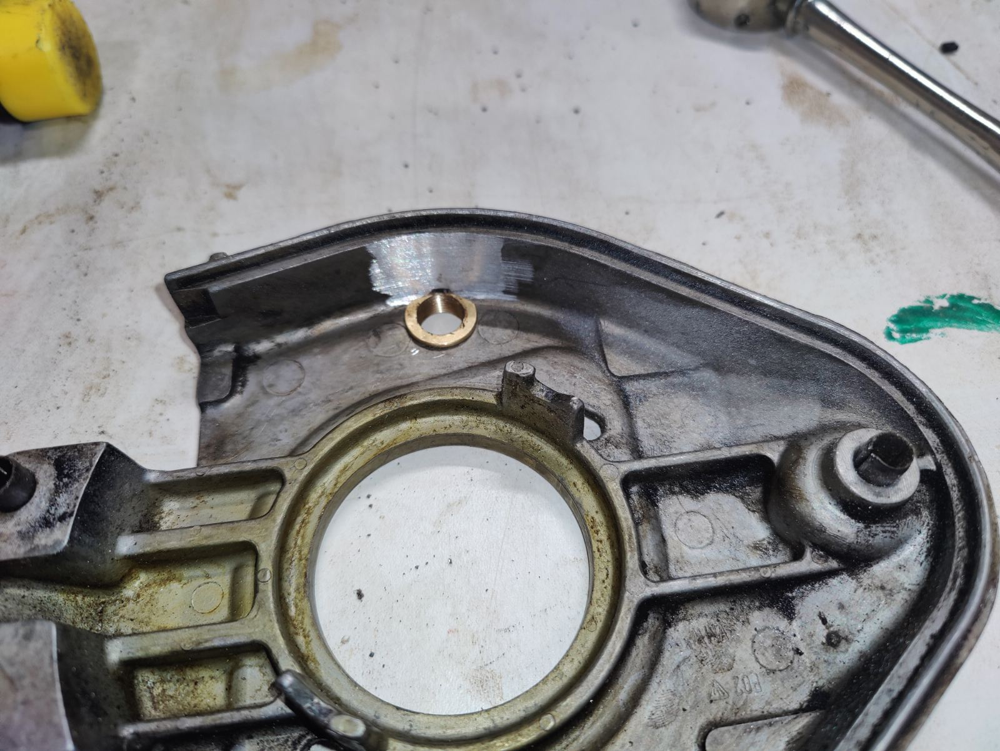
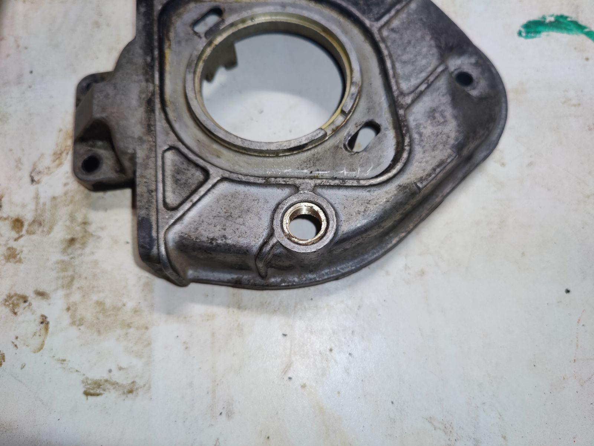
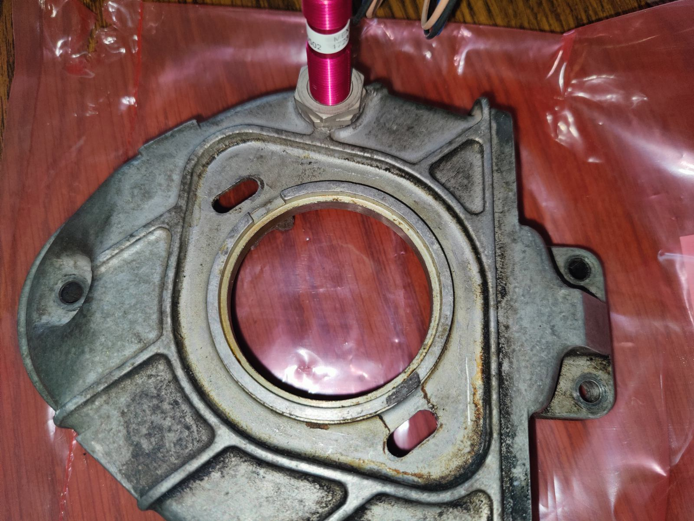
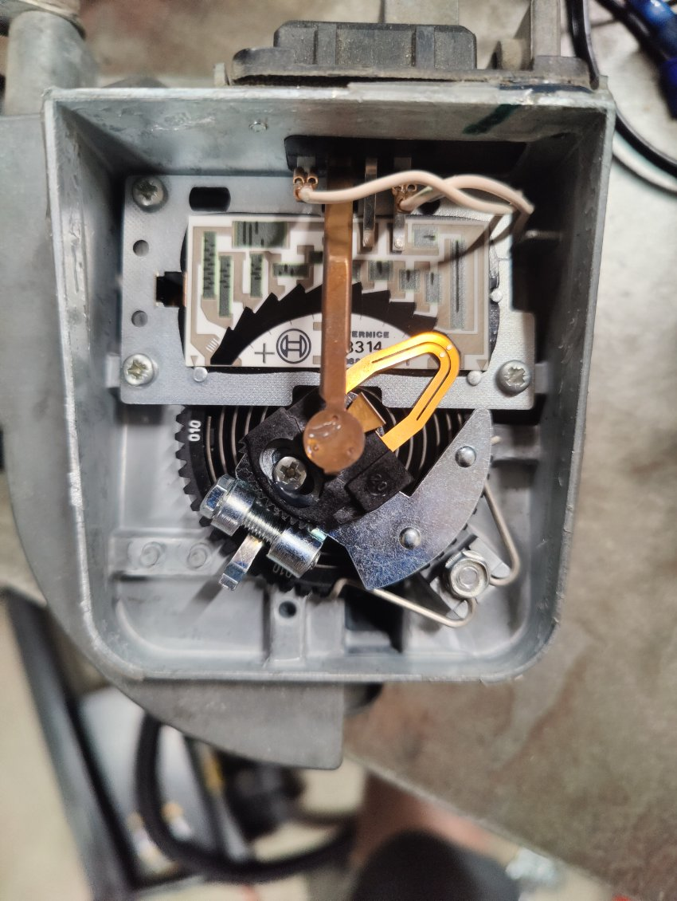
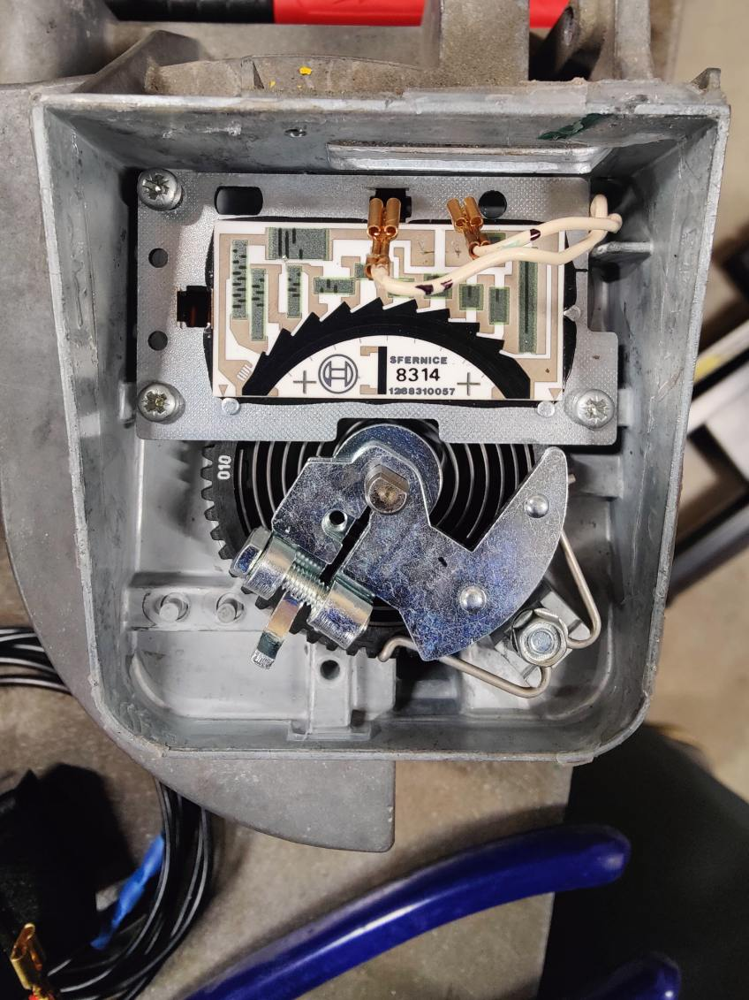
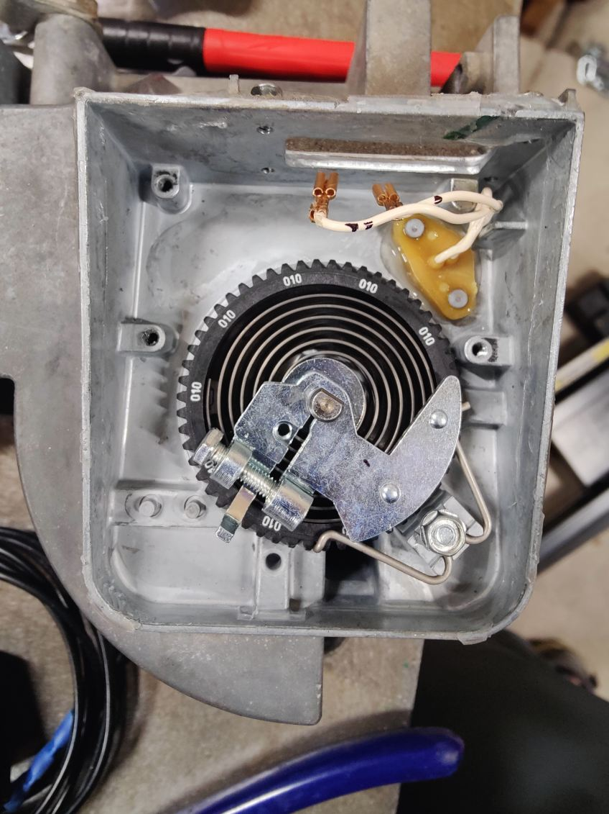
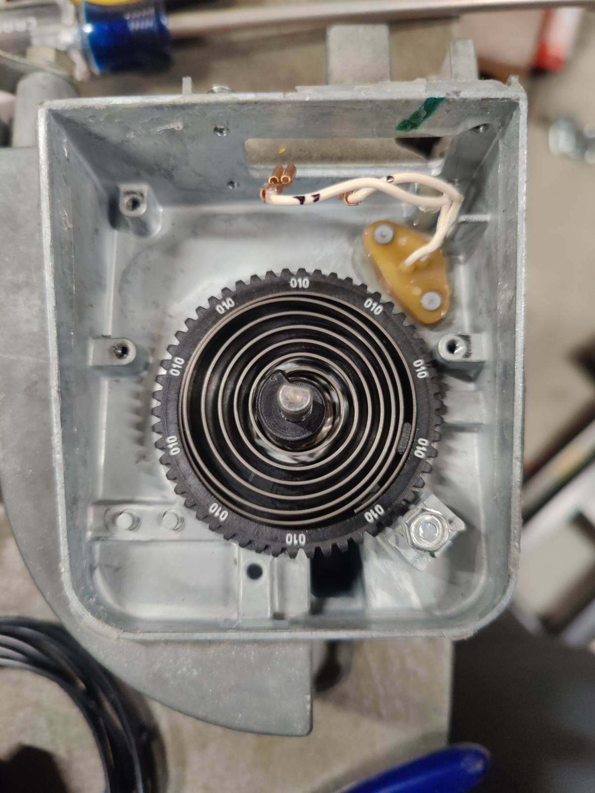
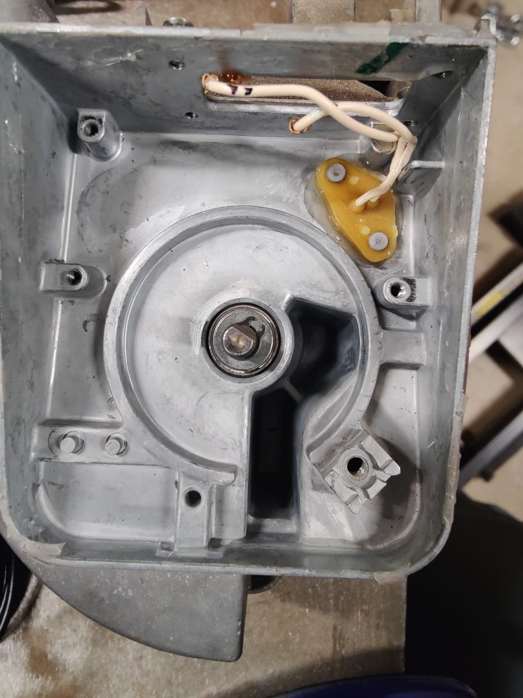
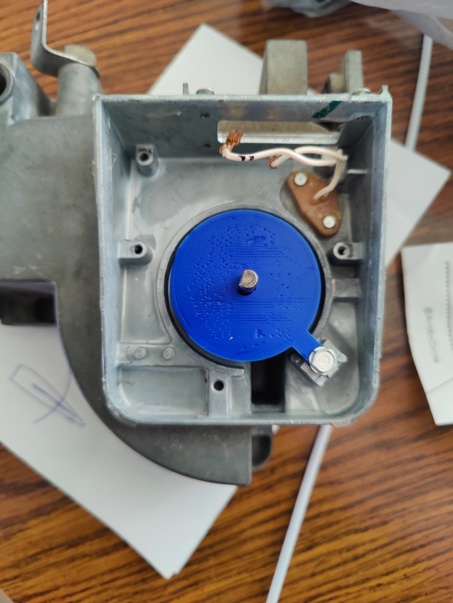
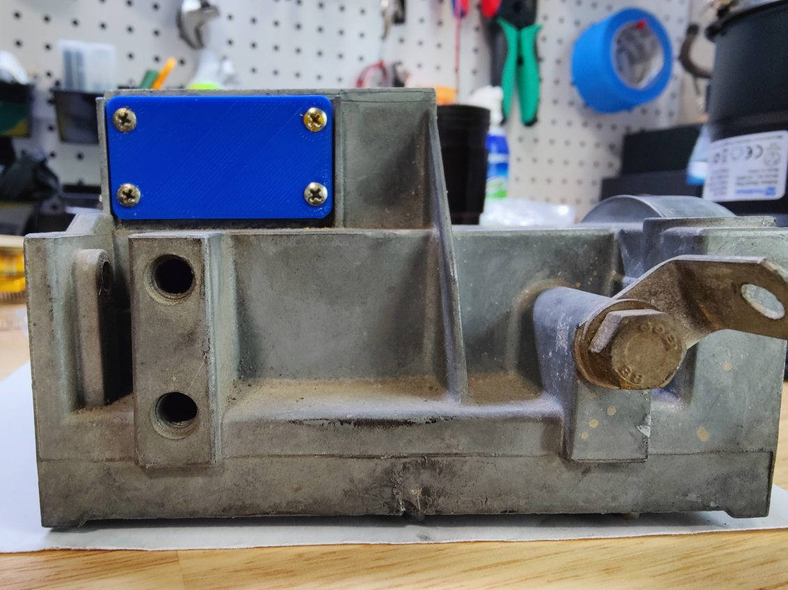

# 944ms

The purpose of this repository is to walk through the microsquirt conversion process on an early Porsche 944 with the following goals in mind:

1. utilize as many of the stock parts as possible
2. avoid or minimize the amount of non-bolt-on modifications and fabrication
3. for any part that must be fabricated, try to do so in a way that is easily or readily available (e.g. 3d printing)

## Sections

 1. [Useful Links](#useful-links)
 2. [Printed Parts](#printed-parts)
 3. [Required Parts](#required-parts)
 4. [Putting it Together](#putting-it-together)

## Useful Links

Though detailed instructions of the entire build can be found in the [Putting it Together](#putting-it-together) section, there are several forums, guides, documentation, and general conversations that were researched and poured over for this project. The information found has proven invaluable and could prove beneficial for other MicroSquirt conversions. They are listed below:

 * [Microsquirt setup/use guide](https://www.useasydocs.com/) (note the [wiring diagram](https://www.useasydocs.com/details/ew3_hires.gif))
 * [General build](https://rennlist.com/forums/924-931-944-951-968-forum/873173-summer-build-thread-megasquirt-and-more-2.html)
 * [General parts overview and tune settings](https://rennlist.com/forums/924-931-944-951-968-forum/831248-a-practical-guide-to-megasquirting-your-944-a.html)
 * [General discussion](https://rennlist.com/forums/924-931-944-951-968-forum/860305-who-is-using-microsquirt-megasquirt.html)
 * Hall sensor on cam: [msextra](https://www.msextra.com/forums/viewtopic.php?t=69564) and [rennlist](https://rennlist.com/forums/944-turbo-and-turbo-s-forum/1088676-fyi-crank-trigger-solution-for-30-no-trigger-wheel-needed.html)
 * [Youtube wiring playlist](https://www.youtube.com/playlist?list=PL6KUN7OA-UQNufmcnJdhSTtK0emy2OQQv)
 * General build checklist: [reddit](https://www.reddit.com/r/megasquirt/comments/3fw4x1/porsche_944_microsquirt_project_completed/) or [msextra](https://www.msextra.com/forums/viewtopic.php?t=59524)
 * TPS alternatives: [951](https://rennlist.com/forums/944-turbo-and-turbo-s-forum/1267168-951-throttle-position-sensor-tps-alternative-solution.html) or [m50](https://rennlist.com/forums/944-turbo-and-turbo-s-forum/968375-what-alternate-tps-units-fit-our-throttle-bodies-2.html)
 * [Alternative VW parts](https://m.me/ch/AbbR2fU9JG5es8ac/)
 * Interchangable parts: [google docs](https://docs.google.com/spreadsheets/d/1jSTkPCnTwhv91jEnysElxuuS8_pDJxy0), [deancent.com](https://www.deancent.com/porsche-944-parts-without-the-premium-price-tag/), or [rennlist](https://rennlist.com/forums/924-931-944-951-968-forum/297421-parts-cross-reference.html?fbclid=IwZXh0bgNhZW0CMTAAAR2T-vss6f12beGLB1Q9gwBURgLfJeHhMngEIeK_rjRKIulUudRIJL4lKlM_aem_AdlfPGBw8oWs6gdXbodP025pRmy-7HwfGuUyPns3zquPYE3SRk7czevwFH37wlQgxFoVKsy0o6G7eVBStKmxIHTE)
 * [DME plug swap](https://rennlist.com/forums/944-and-944s-forum/1266575-microsquirt-ecu-for-porsche-944-s2-motronic-replacement-how-to.html)
 * [Clark's Garage](https://www.clarks-garage.com/) (voltages, current ratings, etc.)

## Printed Parts

All parts were designed to be printed on an Ender 5+ and sliced with Cura. Some adjustments may be necessary depending on the printer and/or slicer, either to the .stl or the printed part itself (e.g. drilling, filing, or sanding down some areas), but general dimensions should be close enough to work. While the links below direct to Thingiverse, the .stl files have also been included under `/printed_parts`.

 * [AFM mods](https://www.thingiverse.com/thing:6618742)
 * [IAT intake tube](https://www.thingiverse.com/thing:6598815)
 * [m50 TPS adapter](https://www.thingiverse.com/thing:6610332)

> Note: the AFM mods and TPS adapter were eventually sent to be machined by a 3rd party service ([SendCutSend](https://sendcutsend.com/)) in 6061 T6 aluminum. While certain plastics likely would have worked well, I opted for a more rigid and heat-tolerant material. They totalled roughly $25.

## Required Parts

The following parts are what were chosen based on price, shipping times, ease of install, or a combination of the aforementioned. Additional parts that were considered but not used are listed [here](#additional-parts-considered). It should be noted that the format is as follows:

> part description | part number | total cost

It should also be noted that the total cost includes taxes and shipping midway through 2024; prices may be different depending on location, availability, and other miscellaneous factors (e.g. inflation, price hikes, etc.).

 1. [MicroSquirt with 8' harness](https://www.diyautotune.com/product/microsquirt-engine-management-system-w-8-foot-wiring-harness/) | MicroSqrt8 | `$390.95`
 2. Cam sync

    * [hall speed sensor](https://www.mouser.com/ProductDetail/ZF/GS100502?qs=%252BrIg%2FMSiRkGdf1qMOzs5Xg%3D%3D&utm_id=9491304176&gad_source=1&gclid=CjwKCAjwuJ2xBhA3EiwAMVjkVAihIm4DqOo11p2CdtaJ0S1ohU4vojb2HMMw9gx_RUu-maX6Dfi2KxoCSI4QAvD_BwE) | 540-GS100502 | `$45.05`
    * [flanged sleeve bearing](https://www.mcmaster.com/) | 7815K62 | `$12.59`
    * [m12 x 1.00 tap](https://www.amazon.com/gp/product/B09X7HYMFM) | M12X1.0_Hand_Tap_RH | `$12.87`
    * [2.4k ohm resistor](https://www.amazon.com/EDGELEC-Resistor-Tolerance-Resistance-Optional/dp/B07HDFRYPK) | B07HDFRYPK | `$5.89`
 3. [GM 1 bar MAP with pigtail](https://www.ebay.com/itm/324792585183) | 12223861 | `$17.17`
 4. [8x Chevy Ignition Coil](https://www.amazon.com/dp/B07FV8C4KJ) | 12611424  | `$89.99`
 5. [2x LS Ignition Coil Bracket](https://www.amazon.com/dp/B0BBR26F6S) | 12558693  | `$26.99`
 6. [4x 33# high-impedence fuel injectors](https://www.ebay.com/itm/266002307469) | 0280150431 | `$96.17`
 7. [GM IAT open-element sensor](https://www.diyautotune.com/product/gm-open-element-iat-sensor-with-pigtail/) | IATwPiggy | `$24.49`
 8. TPS
    * [m50 TPS](https://www.autozone.com/engine-management/throttle-position-sensor-tps/p/uro-throttle-position-sensor-tps-uro-017795/1323039_0_0?searchText=13631721456) | 13631721456 | `$55.81`
    * [2x m3x25 bolt with nut](https://www.amazon.com/gp/product/B0BPFXP2M9) | BXG-M3-400-0012 | `$25.68`
 9. [spartan 2 wideband with LSU 4.9]() (discont. use spartan 3) | NA | `$125.00`
 10. [18"x8" aluminum sheet metal](https://www.acehardware.com/departments/hardware/metal-sheets-and-rods/sheet-metal/5157615) | 5157615 | `$12.99`
 11. [48-position PDC with Terminal Seals](https://www.kinnettickreations.com/product-page/48-position-pdc) | NA | `$55.00`
 12. [2x 4-pin High Capacity Relay](https://www.kinnettickreations.com/product-page/4-pin-high-capacity-iso-280-relay) | NA | `$10.00`
 13. [Mini fuse kit](https://www.amazon.com/dp/B0D5CZNPQW) | BXS001 | `$5.98`

Total parts cost: `$1,012.62`

## Additional Parts Considered

The following are parts that were considered but not used. The indices here correlate with those in the [required parts](#required-parts) section above, as does the structure and format, but the cost may or may not include taxes and shipping as they weren't actually purchased. Additional research should be done before purchasing anything listed here to ensure it will work for your application if you choose to alter your route.

 1. Cam sync
    * [hall speed sensor, digikey](https://www.digikey.com/en/products/detail/zf-electronics/GS100502/361998) | GS100502 | `$46.36`
    * [hall speed sensor, diyautotune](https://www.diyautotune.com/product/crankshaft-position-sensor-hall-effect-threaded-body/) | HallThreaded-K | `$102.99`
    * [camshaft trigger kit, clewett](https://www.clewett.com/index.php?main_page=product_info&cPath=59&products_id=306) | 1002-08 | `$195.00`
    * [camshaft trigger kit, lindsey racing](https://www.lindseyracing.com/LR/Porsche/LRA-EM-CAM-ASSY.html) | LRA-EM-CAM | `$475.00`
 2. MAP
    * [GM 1 bar MAP, amazon](https://www.amazon.com/AUTEX-Manifold-Absolute-Pressure-Compatible/dp/B0BB6J8PB2) | 19106672 | `$15.05`
    * [GM 1 bar MAP, clewett](https://www.clewett.com/index.php?main_page=product_info&products_id=80) | 71110 | `$61.00`
 3. [LS2 coil pack](https://thedubshop.com/ls2-coil-pack-set-import/) | IGN_COIL_LS2-IMP-SET
 | `$99.95`
 4. TPS
    * [951, ebay, used](https://www.ebay.com/itm/166226599785) | 280120400 | `$124.99`
    * [951, ebay, new](https://www.ebay.com/itm/362088697124) | 280120400 | `$244.97`
 5. [distributor delete plate](https://www.clewett.com/index.php?main_page=product_info&products_id=309) | 1002-06 | `$56.00`

## Putting it Together

### Cam sync

A general discussion for utilizing a hall effect sensor can be found on [rennlist](https://rennlist.com/forums/944-turbo-and-turbo-s-forum/1088676-fyi-crank-trigger-solution-for-30-no-trigger-wheel-needed.html). The process used here is similar, with the only difference being the orientation of the sleeve bearing.

As opposed to having the flange of the sleeve bearing on the outside of the cam timing belt cover:

 1. grind/sand down the protruding rib on the inside of the cover closest to the inspection hole and one side of the sleeve & flange
 2. press the sleeve bearing into the inspection hole from the inside with a rubber mallet and a large diameter punch or bold head

3. grind off the protruding portion of the sleeve from the outside

4. clean up the grind and tap the sleeve with an m12x1mm tap

Once tapped, the hall effect sensor should be able to thread easily into the sleeve bearing. This method uses the flange to keep the sensor from backing out of the cover without relying on adhesives.

### AFM modification

For all intents and purposes, the AFM will be used as a glorified intake tube. The gate must be held in the open position to allow full flow of air - this can be done with the [afm gate stop](https://www.thingiverse.com/thing:6618742):

 1. remove the plastic cover on the AFM to reveal its electronics (should pry up - should have some type of silicone or adhesive holding it)

 

 2. unplug both terminals leading to the sensor plug, remove the 4 sensor plug mounting screws (keep track of the screws), and pull the sensor plug out of the case
 
 3. remove the contact wiper arm retaining screw and pull the contact wiper arm out of the case

 

 4. remove the 3 plate mounting screws holding the resistor board down and remove the resistor board

 

 5. remove the clamp bolt and remove the contact mount

 6. remove the bolt holding the spring dial retention clip and remove the retention clip (keep track of the bolt)

 

 7. slide the spring dial off the gate shaft (it's a tight fit, so a flat-head screwdriver may be necessary)

 8. remove the snap ring (image shows it still in place)

 

 9. push the air gate open and slide the [afm gate stop](https://www.thingiverse.com/thing:6618742) down the shaft

 10. bolt the gate stop down

 

 11. attach the [sensor plug block off](https://www.thingiverse.com/thing:6618742) on the outside of where the sensor plug was removed

 

>Note: sealing the sensor plug block off isn't necessary due to the use of the MAP sensor

 12. put a thin bead of high-temp silicone along the top walls where the plastic cover sits and press the cover on

### IAT installation

### TPS adapter
